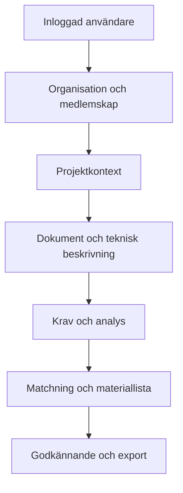

# FlowX-arkitektur

FlowX är en Next.js-klient med server-API ovanpå Supabase Auth, PostgreSQL och
RLS. Identitet och organisation är delade plattformstjänster; domänfunktioner
är project-first. Se [projektstyrning](17_PROJECT_GOVERNANCE.md) för flöde,
datamodell och gates.

Alla övergångar verifieras i API/RPC och databas; frontendens stegindikator är
endast vägledning.
