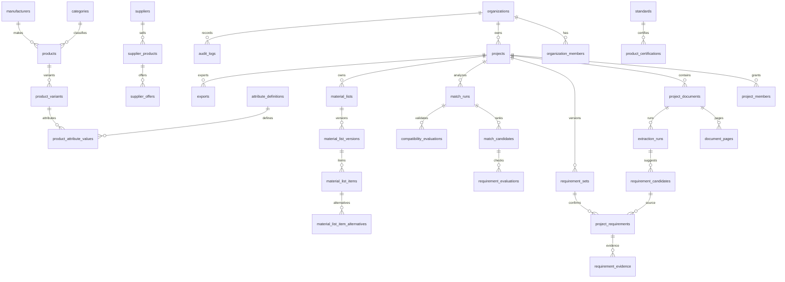

# FlowX databas

## Status

Migrationen `20260804150000_complete_flowx_database.sql` kompletterar den
befintliga modellen utan att byta namn på tabeller eller flytta befintliga
poster. `20260804153000_allow_technical_description_pipeline.sql` ger den
separata tekniska beskrivningsimporten samma tenant- och projektkontroll som
övriga dokumentflödet.

Organisationer, profiler, medlemskap, roller, projekt och audit-logg är
befintliga kanoniska tabeller. FlowX använder `organization_id` som tenantnyckel.
`project_documents` är projektens dokumentmetadata; `documents` är den globala
produktkällkatalogen och ska inte blandas ihop med projektfiler.

## Nya/utökade områden

| Område | Kanoniska tabeller |
| --- | --- |
| Dokument/PDF | `project_documents`, `document_pages`, `extraction_runs` |
| Kravgranskning | `requirement_candidates`, `requirement_sets`, `project_requirements`, `requirement_evidence` |
| Produktkatalog | `categories`, `manufacturers`, `products`, `product_variants`, `attribute_definitions`, `product_attribute_values`, `standards`, `product_certifications`, `product_documents` |
| Leverantörer | `suppliers`, `supplier_products`, `supplier_offers`, `catalog_imports`, `catalog_import_errors` |
| Matchning | `compatibility_rule_sets`, `compatibility_rules`, `compatibility_evaluations`, `match_runs`, `match_candidates`, `requirement_evaluations`, `commercial_scenarios` |
| Material/export | `material_list_versions`, `material_list_items`, `material_list_item_alternatives`, `exports` |
| Referenser | `reference_projects`, `reference_project_products` |

Projektinställningar ligger kvar som kolumner på `projects`, eftersom den
befintliga modellen redan innehåller land, standard, systemtyp och kommersiella
inställningar. En separat `project_settings`-tabell skapades därför inte.

## Dataprinciper

- Alla tenant- och projektposter har `organization_id` och/eller `project_id`.
- Globala tekniska produktdata är läsbara endast som godkända/aktiva poster.
  Företagsspecifika priser och lager ligger i `supplier_offers`.
- AI/PDF-resultat börjar i `requirement_candidates`. Endast en användargranskad
  rad i `project_requirements` är ett bekräftat krav.
- Matchning använder `pass`, `fail`, `unknown`, `not_applicable`. Ett
  obligatoriskt `fail` blockerar teknisk matchning; `unknown` kräver manuell
  granskning före ranking.
- Affärskritiska tabeller använder `deleted_at` där befintlig modell stödjer
  soft delete. Audit-poster raderas inte av vanliga användare.

## Säkerhet och databaslogik

RLS återanvänder `is_organization_member`, `has_permission` och
`can_access_project`. Nya scope-triggers är `enforce_database_project_scope`.
Kritiska ändringar loggas av `audit_database_change`, och
`validate_material_list_item_selection` kräver positiv kvantitet samt motivering
för tekniska undantag. SECURITY DEFINER-funktionerna har explicit `search_path`
och är inte körbara av `anon`/`authenticated`.

## ER-diagram

## Migration och typer

Kör migrationerna i filnamnsordning via Supabase. Fulla TypeScript-typer kan
regenereras med kommandot i `apps/web/src/types/database.ts`; de handhållna
domänaliasen används vid API-gränser tills en genererad fil checkas in.
