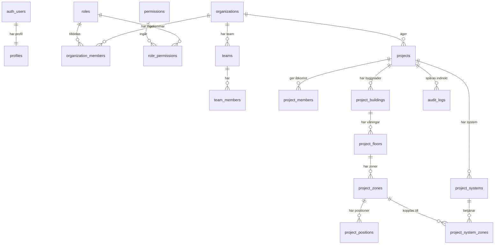
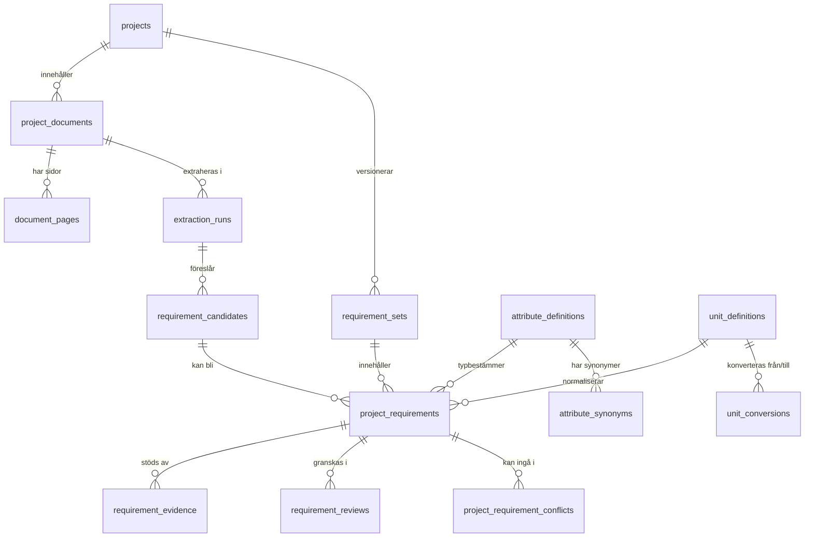
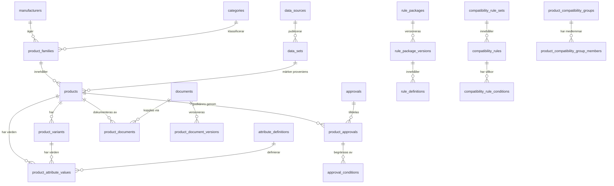
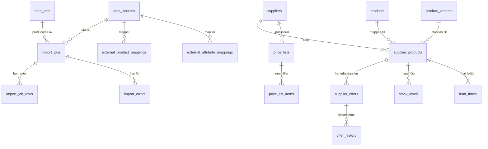
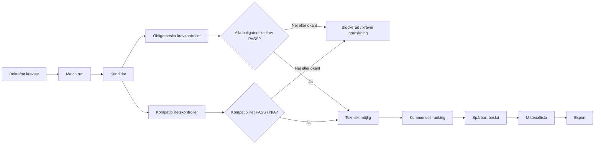

# FlowX ER-diagram

Diagrammen visar kanoniska tabeller. Kompatibilitetsvyer är utelämnade för att
inte ge intrycket att samma information lagras två gånger.

## Tenant, användare och projekt

## Dokument och krav

## Produkt, dokument, godkännande och regler

## Import och kommersiell data

## Teknisk grind, ranking och materiallista

Databasconstraints stoppar en direkt genväg från kommersiell ranking till vald
produkt. Ett tekniskt `fail` eller `unknown` måste lösas i tekniska data eller
kravgranskningen, inte med pris, lager, leveranstid eller ett fritextundantag.
