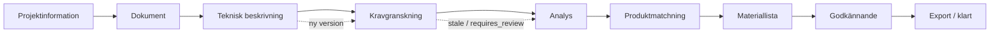
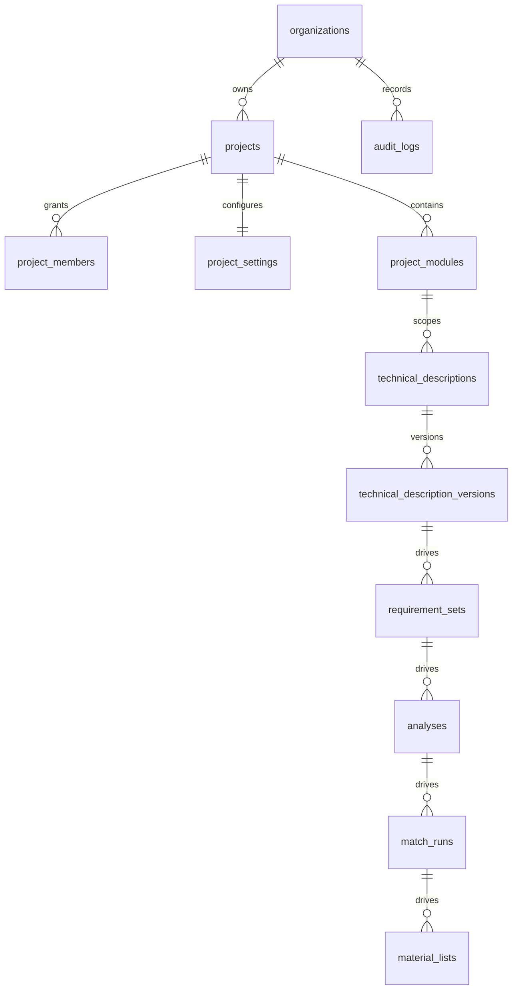

# Projektstyrning (project-first)

FlowX använder projektet som arbetskontext. Dokument, teknisk beskrivning,
krav, analys, produktmatchning, materiallista och export får inte skapas eller
köras utan ett åtkomligt projekt. Organisationer, Auth-profiler och
organisationsmedlemmar är den befintliga identitetsmodellen och återanvänds.

## Flöde

`status` (draft, active, on_hold, completed, archived) beskriver projektets
livscykel. `current_stage` beskriver var arbetet befinner sig och valideras
separat av databasen.

## Datamodell

Migrationen `20260805100000_implement_project_governance.sql` kompletterar
projektfält, projektmedlemskap, `project_settings`, `project_modules`, tekniska
beskrivningar/versioner, versionsberoenden, stale-markering och workflow-gates.
RPC:n `create_project_with_defaults` skapar projekt, standardinställningar,
sprinkler-modul, projektansvarig och audit-händelse i samma transaktion.

## API och routes

- `POST /api/projects` använder den atomiska RPC:n; organisation hämtas från
  serverns medlemskap och kan inte väljas fritt av klienten.
- `GET /api/projects` visar endast projekt som RLS tillåter och stödjer listans
  sökning, status/steg-filter, sortering och "mina projekt" i UI.
- `PATCH /api/projects/[id]` validerar arbetssteg och låter inte en klient byta
  organisation.
- `POST /api/technical-descriptions` kräver `projectId` och en aktiv sprinkler-
  modul; dokumentet sparar `project_module_id`.
- Projektarbetsytan finns på `/projects/[id]` och alla projektsteg har routes
  under `/projects/[id]/...`. Sektionerna är gemensamma ytor; detaljerade
  domänflöden byggs vidare i respektive modul.

## Säkerhetsregler

RLS på projektbundna tabeller kontrollerar organisation och projektåtkomst i
samma policy. Organisationsägare/-administratörer ser organisationens projekt;
övriga användare måste vara aktiva projektmedlemmar. Servertriggers blockerar
analys utan dokument, matchning utan bekräftade krav, materiallista utan
slutförd matchning och export utan godkänd materiallista. Arkiverade projekt
behåller historik och raderas inte hårt av ordinarie flöden.

## Begränsningar och nästa steg

Projektsektionerna har nu en gemensam, åtkomstskyddad scaffold och översikt.
Nästa steg är att flytta varje befintlig PDF-, krav-, analys- och
materiallistevy till respektive sektion, lägga integrationstester mot en
transaktionell Supabase-testdatabas och komplettera gate för hanterade tekniska
avvikelser före godkännande.
